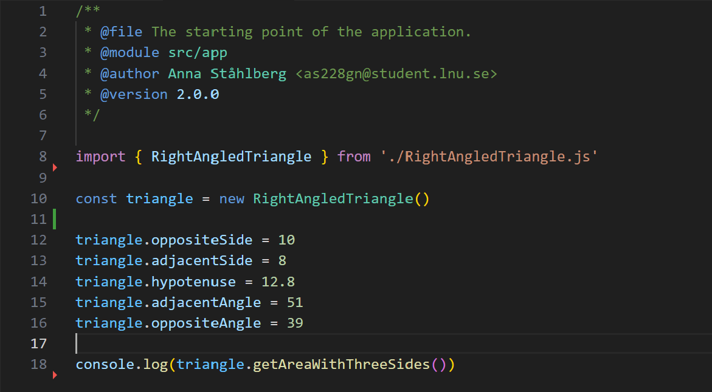
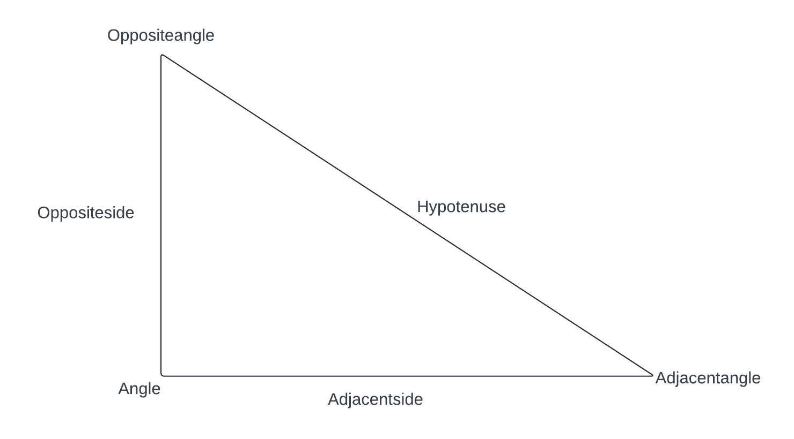

# Geometry module
This is a geometry module that helps you calculate different calculations on a right-angled triangle, rectangle and circle. It helps you calculate the area and perimeter, on the right-angled triangle it also helps you calculate the angles and sides. For all three shapes you can increase the area by a percentage and get the new measurements for the different sides.

## Usage
To use the module you import the class you want to use (Circle, Rectangle or RightAngledTriangle) and make a new object of it, you set the known properties and call the function you want to use. Se example below.

### Circle
#### Properties
radius  
diameter
#### Functions
getCircumferenceWithRadius()  
Returns the circumference, needs the radius property.  

getCircumferenceWithDiameter()  
Returns the circumference, needs the diameter property.  

getArea()  
Returns the area, needs the radius property.  

increaseOrDecreaseByPercent()  
Sets the new property measurments to increase the percentage by the percent being sent in to the function.  
### Rectangle
#### Properties
length  
width
#### Functions
getPerimeter()  
Returns the perimeter, needs the length and width properties.  

getArea()  
Returns the perimeter, needs the length and width properties.  

increaseOrDecreaseByPercent()  
Sets the new property measurments to increase the percentage by the percent being sent in to the function.  
### RightAngledTriangle
#### Properties
hypotenuse  
adjacentSide  
oppositeSide  
adjacentAngle  
oppositeAngle  
angle = 90  

To call the functions correctly, it is important to know which property is which. See picture below to understand their locations.

#### Functions
getAreaWithThreeSides()  
Returns the area, needs the hypotenuse, adjacentSide and oppositeSide properties.  

getPerimeter()  
Returns the perimeter, needs the hypotenuse, adjacentSide and oppositeSide properties.  

getHypotenuse()  
Returns the hypotenuse, needs the adjacentSide and oppositeSide properties.  

getOppositeSideWithAdjacentSideAndHypotenuse()  
Returns the oppositeSide, needs the adjacentSide and the hypotenuse properties.  

getAdjacentSideWithOppositeSideAndHypotenuse()  
Returns the adjacentSide, needs the oppositeSide and the hypotenuse properties.  

getOppositeAngleWithAdjacentAngle()  
Returns the oppositeAngle, needs the adjacentAngle property.  

getAdjacentAngleWithOppositeAngle()  
Returns the adjacentAngle, needs the oppositeAngle property.  

getAdjacentSideWithAdjacentAngleAndHypotenuse()  
Returns the adjacentSide, needs the adjacentAngle and the hypotenuse properties.  

getHypotenuseWithAdjacentAngleAndSide()  
Returns the hypotenuse, needs the adjacentAngle and the adjacentSide properties.  

getAdjacentAngleWithAdjacentSideAndHypotenus()  
Returns the adjacentAngle, needs the adjacentSide and the hypotenuse properties.  

getOppositeAngleWithOppositeSideAndHypotenuse()  
Returns the oppositeAngle, needs the oppositeSide and the hypotenuse properties.  

increaseOrDecreaseByPercent()  
Sets the new property measurments to increase the percentage by the percent being sent in to the function. 